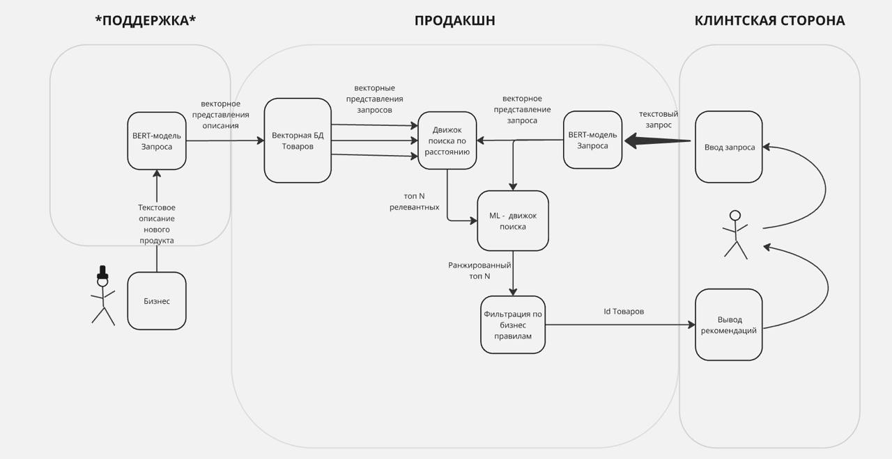

# Раздел 1. ML Product Design

## 1.1. Бизнес обоснование
### Какую бизнес-проблему мы решаем?
Глобально, мы решаем проблему донесения ценности; как это проявляется? Если мы плохо понимаем, чего хочет пользователь в запросе, то предлагаем ему нерелевантные товары - в свою очередь юзер, видя нерелевантные товары, НЕ НАХОДИТ решение для своего запроса, считая, что у нас его (решения) нет. Тут и происходит НЕдонесения ценности. Наша задача правильно понимать запрос юзера и предлагать ему правильные вещи, показывая ценность нашей платформы. 

### Плохие пользовательские сценарии
Запросы сложнее "морковь". Например "Что-то сладкое к вечернему чаю" или более абстрактное, или же с обилием прилагательных, которые как-то характеризуют товар, а мы это не понимаем и не учитываем.

### Зачем существует вообще этот процесс?
Этот процесс нужен, чтобы из множества вещей, которые у нас есть, предложить самое релевантное по запросу юзера. Другими словами - показать юзеру “смотри, какие у нас решения твоей проблемы”.

### Ключевой заказчик
Бизнес, т.к. мэтчинг запросов с товаром напрямую влияет на то, какую долю проблем мы решаем => сколько мы продаем + сколько у нас довольных клиентов => сколько мы зарабатываем

### Описание проблемного сценария
1. Пользователь вводит в пользовательскую строку абстрактный запрос, например: “Ингредиенты для новогодних салатов”
2. Поисковый сервис выдаёт нерелевантные ответы/ вообще не выдаёт ответы на запрос.
3.  Пользователь уходит с поисковой строки, не добавив ничего в корзину/ не совершив покупку.

### Связь с метриками:
Вообще это связано со всеми метриками, но вот главные:
- Конверсия в покупку
- Средний чек
- Mau dau платформы
- Среднее время поиска товаров
- Retention, churn

### Элементы процесса и связи:
- Конкретный запрос юзера
- Данные товара: картинки, название, описание, цена
- Алгоритм ранжирования: товарам присваивается некая характеристика “насколько это подходит под запрос”
- Непосредственная поисковая выдача платформы

### По какой логике процесс управляется, как принимаются решения:
Data driven процесс - анализируем метрики, чтобы понимать, насколько лучше или хуже мы понимаем запрос пользователя и как они оценивают наши предложения

### Как проблема решается сейчас:
- Просто пытаемся вытащить из запроса ключевые слова и смэтчить с НАЗВАНИЯМИ товаров
- Рандомное ранжирование товаров
- Селекторы по цене\отзывам\срокам доставки и др

### Какие в прошлом сделаны попытки для решения проблемы:
Ввели алгоритм ранжирования по релевантности к запросу: пытаемся вытаскивать вверх названия товаров, которые совпали со словами из запроса. Раньше было много кнопок “Категория” -> “Подкатегория” а потом селекторы

## 1.2. Критичность бизнес-процесса
Рекомендательная система в поиске товаров играет важную роль в увеличении конверсии, среднего чека и удержания пользователей. Поиск — это ключевой путь пользователя к покупке, а его эффективность напрямую влияет на доход компании.

### Последствия инцидентов
- Tier-2 (P2): Работа с сильными ухудшениями (потеря точности, отсутствие релевантных товаров) → снижение конверсии, но поиск еще работает.
- Tier-3 (P3): Незначительные ухудшения (например, хуже ранжирование, но товары отображаются) → влияет на эффективность бизнеса, но не критично.
- t2-t3 критичность (в зависимости от потока запросов)

При ухудшении поиска пользователи сталкиваются с нерелевантными результатами, что снижает вероятность добавления товаров в корзину и завершения покупки.
Если поиск не работает вообще, то пользователи либо покидают приложение, либо ищут товары вручную (что сильно снижает удобство и может привести к оттоку).
Снижение конверсии запросов в покупки приводит к прямым финансовым потерям. Например, даже 1% падение конверсии при годовой розничной выручке 2 491 млрд руб. может привести к потерям порядка 25 млрд руб. в год.

### Что будет, если сервис не работает?
- Несколько минут: Незначительное влияние, так как пользователи могут повторить поиск позже.
- Несколько часов: Потеря части заказов, так как пользователи, не найдя товары, могут не совершить покупку. Допустим, за час магазин обрабатывает ~700 тысяч посещений (6196 млн / 8760 часов в году), и потеря даже 1% конверсии может значить потерю сотен миллионов рублей.
- Несколько дней: Существенное снижение доходов, удар по пользовательскому опыту, рост недовольства клиентов и ухудшение репутации. Вероятен отток пользователей к конкурентам.

### Что будет, если сервис работает, но с ухудшением качества?
- Если система поиска и рекомендаций выдает менее релевантные товары, это снижает конверсию. Например, если из-за ухудшения поиска средний чек падает на 5%, это потенциально 125 млрд руб. потерь в год.
- Негативный пользовательский опыт может привести к снижению возврата клиентов, что увеличит расходы на привлечение новых пользователей.

### Допустимая длительность простоев
Допустимый простой: не более 1% общего времени работы, что эквивалентно примерно 87 часов в год или 7 часов в месяц.
При простоях свыше этого порога компания начнет терять значимые суммы и ухудшать клиентский опыт.

### Что нам надо знать про отрасль и состояние рынка, на котором работает компания?

Некоторые Крупные федеральные ретейлеры уже используют продвинутые поисковые системы в своих приложениях и веб сервисах, в том числе с семантическим поиском и продвинутым рандированием. Однако региональные и некоторые федеральные ретейлеры отстают в развитии клиентских сервисов из-за недостаточного фокуса на ит инновациях 

###  Как данная проблема соответствует бизнес-стратегии компании?
Стратегией компании на ближайшие 5 лет является:
- Увеличение клиентской базы 
- Повышение лояльности клиентов 
- Расширение онлайн присутствия ритейлера и увеличение доли онлайн заказов
- Развитие позитивного клиентского опыта в онлайне

В итоге данная проблема препятствует достижению целей по развитию клиентского опыта и расширению онлайн присутствия.

### По шкале от 1 до 10, какой приоритет данная проблема имеет для вашего департамента/отдела?
10. На данный момент у компании уже неплохой онлайн сервис для клиентов, который нуждается в модернизации для улучшения пользовательского опыта. Внедрение семантического поиска - одно из приоритетных направлений работы в этом году.

### Почему именно сейчас хотим проблему решить?
Федеральные конкуренты, в том числе в нашем ценовом сегменте, уже имеют данный функционал, а также большую долю рынка онлайн заказов, в результате чего мы отстаём в данном сегменте. Развитие онлайн сервисов позволит отбить обратно/увеличить долю присутствия в онлайне

### Что будет, если ничего не менять?
Компания не сможет эффективно бороться за текущих клиентов, а также привлекать новых вследствие западающего качества онлайн сервиса.
В результате это препятствует достижению бизнес целей на ближайшие 5 лет.

### Стейкхолдеры
Список заинтересованных лиц, которые могут считаться причастными к проекту: они могут как-то касаться процесса или на их рабочую деятельность будет влиять наша система (имя, роль, департамент):
    Product Owner (руководитель проекта)
    Роль: ответственный за координацию действий команды
    RACI: Accountable, Responsible
    ЛПР: да 

    Бизнес заказчик ( CEO, C-lvl ): 
    Роль: лицо распределяющее ресурсы, заинтересованное в улучшении финансовых показателей
    RACI: Consult, Informed
    ЛПР: да

    Команда разработки: 
    Роль: Катить релизы, чтобы все работало (опционально)
    RACI: Responsible
    ЛПР: нет

### Клиенты
Кто конечный пользователь системы (напрямую взаимодействует с результатами работы нашей системы)?
- Клиенты магазина Y6:  юзеры платформы/ приложения

Для чего он использует систему? Какие у него есть потребности?
- Для поиска товаров в каталоге магазина
- Быстрый и точный поиск товаров по запросу 

Есть ли разные типы пользователей с различными правами доступа? - Нет.

## 1.3. Value Proposition

### Почему требуется применить ML для решения данной проблемы? Можно ли решить проблему без применения ML?
Проблема семантического поиска также может быть решена применением набора эвристик и бизнес-правил, в результате внедрения которых возможно получить какое-то качество. Однако с ростом базы товаров, увеличения клиентов, усложнением пользовательских запросов и в целом с глобальной сменой клиентского опыта в сторону гибкости и персонализации  ML решение будет больше соответствовать запросам бизнеса и клиентов.

### Какие возможности ML дает при решении данной проблемы по сравнению с традиционными подходами?
ML решения позволяют предоставить клиенту:
- возможность формулировать абстрактные запросы
- получать в ответ на запрос релевантные товары

### Бейзлайн
В качестве бейзлайна можем пойти по следующему пути увеличения сложности решения:
1. Точное совпадение запроса и названия товара
2.  Совпадение запроса и любое из следующих: как минимум одно слово из названия товара, категории в каталоге
3. Первоначальная обработка запроса: проводим лемматизацию каждого слова, ищем существительные. Далее матчим каждое найденное существительное с базой товаров - ищем такие же названия товаров и/или категорий в каталоге и выводим в качестве ответа
4. Предобрабатываем запрос лемматизацией, каждое слово отдельно прогоняем через сетку для получения латента и ищем top-k ближайших товаров по косиносному расстоянию

### Ценностное предложение. Как данное решение повлияет на всех участников бизнес-процесса и клиентов?
1. Влияние на клиентов:
Клиенты смогут делать гибкие запросы любой сложности и получать на них релевантные ответы. Кроме того, решение можно будет дорабатывать для большей персонализации под каждого пользователя.

2. Влияние на  заказчиков из бизнеса:
Позитивные изменения ключевых бизнесовых метрик: средний чек, количество заказов, GMV

3. Влияние на продукт
Позитивные изменения продуктовых метрик (аналогично бизнесовым) + CSAT поиска, конверсия в заказ/добавление в корзину. Однако могут быть негативные последствия для параллельных метрик альтернативного поиска - например, поиска через каталог товаров или поиска через подборки (как в Самокате)

## 1.4. Business Metrics & Success

### На какие ключевые бизнес/продуктовые-метрики влияет проблема? Насколько сильно они страдают?

1. Конверсия в корзину\в покупку\ в избранное и др.
2. Время поиска товара
3. Bounce rate
4. Средний чек
5. Кол-во покупок
6. Выручка
7. Частота повторных посещений

###  Существует ли пирамида/иерархия метрик, отражающая связи между ними?
- Да. Выручка зависит от конверсий, среднего чека, частоты повторных посещений. Конверсия (и кол-во покупок) зависит от эффективности поиска, удобства UX/UI.

### Какие изменения по метрикам будем считать успехом? Какие есть контр-метрики, которые нам надо не уронить?
Положительные изменения:
1. Снижение уровня отказов (bounce rate)
2. Увеличение конверсии
3. Выручка в плюс
4. Рост среднего чека
5. Среднее количество пролистанных страниц до добавления в корзину в минус

Контр-метрики (не хотим ронять):
1. Скорость загрузки страниц
2. Качество подбора товаров (оценить через 5 звезд?)
3. Удовлетворенность пользователей
4. Эффективность других инструментов магазина

### Какой минимальный эффект, на который мы согласны (ниже которого создание модели не имеет смысла)? Этот эффект достичь реально?
1. Качество ранжирования лучше простых эвристик (измеряем по конверсии в покупку, ожидаем +5% минимум)
2. Сравнение с альтернативными методами поиска (если доля супер мала, нафига мы это выкатили)
3. Рост среднего чека минимум на 3%

## 1.5. Затраты и оценка окупаемости (Cost Structure & ROI)

### Структура затрат:
Фонд оплаты труда (ФОТ):
На этапе разработки прототипа (MVP) потребуется команда из:
- 2 специалистов по машинному обучению:
- Один с опытом в NLP.
- Один Data Scientist.
- 1 проект-менеджер (PM).
- 1 разработчик (для интеграции и поддержки инфраструктуры).
На этапе поддержки и развития решения потребуется:
- 1 специалист по машинному обучению.

### Инфраструктура:
Для разработки и эксплуатации модели потребуются вычислительные ресурсы:
- 8 GPU (T4) для нейросетевых подходов.
Также необходимо учитывать затраты на поддержку инфраструктуры:
- Облачные сервисы.
- Мониторинг.
- Резервное копирование.

### Другие расходы:
- Затраты на поддержку инфраструктуры.

### Оценка времени на разработку проекта:
- 3 месяца на создание MVP (минимально жизнеспособного продукта).
- 6 месяцев на полную реализацию и оптимизацию решения.

### Изменение затрат со временем:
Затраты на вычислительные ресурсы:
- Начнутся после ввода проекта в эксплуатацию.
Затраты на ФОТ:
- Будут постоянными на всех этапах (разработка, поддержка, развитие).
Затраты на поддержку инфраструктуры:
- Останутся примерно на одном уровне после выхода проекта в продакшн.

### Оценка окупаемости проекта
Доход от инвестиций:
Ожидается увеличение конверсии в покупку на 10%.
Это приведет к росту выручки и улучшению ключевых метрик бизнеса.

Ожидаемое время возврата на инвестиции:
Окупаемость проекта ожидается через 6 месяцев после внедрения решения.

## 1.6. Бизнес-ограничения, допущения и риски (Assumptions, Risks and Constraints).

### Ограничения
#### Ограничение на архитектуру, т.к. мы должны интегрировать поиск с текущей системой.
- Ресурсные ограничения понятно - финансовые, технические, человеческие
- Ограничения, связанные со стратегией компании - это может повлиять на архитектуру и функции нашего поиска

#### Ограничения на модель:
- Интерпретируемость важна, на трансформеры можно накрутить.
- Может быть важно учесть какие-то фичи. Это вытекает из бизнесовых ограничений (например, бизнес отдел обязывает учитывать пол юзера, если известен)
- Совместимость с текущей системой
- Ограничение по сложности используемой модели

#### Какие ожидания по срокам проекта от заказчика?
- Полгода

### Допущения о клиентах:
- Пользуются поисковой строкой в основном.
- Клиенты ±в нужном направлении формируют продуктовый запрос
- Клиенты чаще покупают на сайте, если у них был хороший опыт взаимодействия с магазином
- Клиенты покупают больше, если поиск лучше

### Допущения о бизнес-среде
- В ближайшее время не появится более технологичных решений проблемы поиска
- Спрос на товары из магазина останется высоким 

### Риски
- Возможно мы неверно понимаем направление развития обработки пользовательских запросов
- Неверная оценка сроков проекта, ресурсов на реализацию или поддержку
- Изменится стратегия компании, руководство передумает

# Раздел 2. Solution Design
## 2.1 Данные

### Какие данные доступны для обучения модели?
Будут использоваться открытые датасеты с Kaggle, которые содержат подходящее нам по формату описание товаров E-com
Выбранный нами датасет, в частности, является живым примером магазина, а именно данные 30 тысяч товаров из Walmart, актуальные на 2019 год.
Данные находятся в формате  csv файла, поэтому работать с ними очень удобно.
Разметка будет использоваться при оценке результатов. Поскольку идея проекта заключается в мэтчинге абстрактного запроса с товарами магазина, то необходимо будет определить - насколько хорошо отработал наш алгоритм.

### О данных:
Среди прочего, в данных более 4000 подходящих нам товаров, при этом каждый товар содержит описание от 10 слов. Шумы есть в виде адресов, контактных номеров производителя и др.
Данные обновляются раз в сутки регулярным процессом, который обходит текущие товары и все внесенные в описания правки, производя слияние. В момент применения модели (на inference) данные будут доступны.
В нашем случае, нет необходимости работать с персональными данными.
Из допущений - нам приходится требовать от описаний товара длины от 10 слов. В случае, если это не будет выполняться, мы не будем учитывать в ранжировании такие описания

## 2.2 Технические ограничения и риски
Цель этого блока
Понять систему технических ограничений, в которой придется работать над проектом
Выяснить, какие из этого следуют риски. И с какими проблемами мы можем столкнуться при реализации

### Ограничения
Есть ли у нас требования по интеграциям, которые надо предусмотреть? 
- Интеграция с нашим источником данных

Есть ли у нас зависимость от каких-то важных технологических компонент, которые до сих пор не реализованы?
- Нет

Какие есть инфраструктурные ограничения?
Сколько и каких ресурсов нам надо для обучения (train) и применения (inference) модели?
- <100 gpu\часов

Доступны ли нам ресурсы по gpu/cpu/ram в полном объеме?
- Да

Учтены ли требования к масштабированию системы?
- Предполагаем, что да

Требуется разворачивать систему в облаке или on premis?
- Облако

Какие есть ограничения на стек?
- Карт бланш

Какие у нас есть ограничения по скорости ответа сервиса?
- < 1 сек (90й перцентиль)

Какие есть ограничения по частоте обновления прогнозов модели?
- Раз в день

Какие есть ограничения с точки зрения информационной безопасности?
- Нет, т.к. мы не учитываем персданные при запросах

### Допущения
Какие допущения можно сделать о действиях пользователя, качестве модели или продуктивизации? 
- Пользователь вводит запросы из адекватных слов

### Риски
Какие риски вытекают из ограничений, описанных выше?
- Недооценка допущений может привести к проблемам на стадии разработки
Какие технические проблемы могут помешать попасть в сроки?
- Данные описания товаров недостаточно полные
- Выбранный алгоритм будет плохо решать задачу
- Обучение затянется по времени
- Не хватит вычислительных ресурсов, чтобы потянуть текущую нагрузку по запросам

### Какие технические проблемы могут помещать завершить проект?
- Заказчик передумает\изменится мейнстрим направления

## 2.3 Функциональные и нефункциональные требования

1. Какие основные функции должны быть реализованы?

• Пользователь имеет возможность ввести запрос на естественном языке и получить в ответ релевантный отранжированный список товаров

• В ответе присутствуют только актуальные товары

2. Какое поведение ML-модели заказчик ожидает? Возможно, у него есть желаемый образ результата. Возможно, этот образ надо на старте заземлить и скорректировать, чтобы человек не обманывал себя ожиданиями

Основной пользовательский сценарий выглядит так:

• Пользователь вводит в поисковую строку свой запрос на естественном языке – для mvp ограничимся русским

• В ответ на запрос пользователь получает список релевантных, отранжированных и актуальных товаров 

• Пользователь может скорректировать запрос/настроить фильтры – в ответ получает следующий набор товаров

3. С какими внешними системами должна работать наша система? Какие интеграции нам надо предусмотреть?

• Источник данных о товарах: список всех товаров, их названия, описания, характеристики, другие метаданные, если будут. Это интеграция с DWH/продовой БД

• Система мониторинга в компании – для отслеживания показателей модели/бэкенда

• Система долгосрочного хранения данных – DWH/аналитические БД – для отгрузки данных для аналитики

4. Взаимодействие пользователей с системой

Как результаты работы модели (предсказания) должны выглядеть для конечного пользователя? Какой формат должны иметь выходные данные?

• Предполагается, что сервис предсказаний в ответ на текстовый запрос от пользователя отдаёт список релевантных товаров – sku каждого товара. Формат выходных данных – json с полем skus, в котором лежит список товаров

Как пользователь будет взаимодействовать с результатами работы модели (выгрузка данных, построения аналитики итд)? Требуется ли создать дополнительные user-интерфейсы?

• Фронту для отрисовки результата предсказания отдаём только список кодов товаров

• Для построения аналитики в систему долгосрочного хранения можно отгружать связку id запроса + текст запроса + id предсказания + список skus – кодов товаров

• Дополнительные user интерфейсы для работы с результатами модели создавать не планируем, для аналитики работы алгоритма будем использовать выгрузку из аналитической БД и bi-системы на стороне

Каковы ожидаемые результаты различных действий пользователей?

Основной сценарий: пользователь вводит текстовый запрос и получает отранжированный список релевантных товаров.

Альтернативные сценарии:

• Если на запрос модель не смогла найти ни одного товара (пользователь ввёл слишком сложный запрос) – передаём запрос на дефолтный предсказатель по словам

4. Требуется ли пользователям дополнительно вводить данные в систему?Например, требуется ли предусмотреть сценарии "ручного вмешательства" в предсказания (например black/white-листы, ручные корректировки бизнес-показателей итд)? Нужно ли предусмотреть для этого дополнительные интерфейсы?

• Для продвижения спонсорских товаров требуется замешивать в предсказанный список новые сущности. Однако эта логика будет реализована на другом бэкэнде/частично на фронте, поэтому для нашего сервиса нерелевантны допинтерфейсы

5. Какие изменения в существующий CJM (клиентский путь при работе с системой/процессом) будут внесены? Ок ли это для наших пользователей? Как мы можем сделать эти изменения более user-friendly?

• Пользователи не должны заметить изменения клиентского пути в приложении. 

5. Как пользователи должны быть уведомлены о проблемах?

• При отказе/любых проблемах с сервисом предсказаний планируется fallback на дефолтный предсказатель по словам.

6. Есть ли требования к хранению данных внутри системы и к их структуре?

• Данные необходимо отгружать в систему долгосрочного хранения. Примерная структура: id запроса + текст запроса + id предсказания + список skus

7. Какие есть corner cases в работе системы, которые надо предусмотреть?

• Если сервис не работает – применяем фолбэк на дефолтный предсказатель по словам

• Если модель не смогла выдать ответ по запросу – применяем фолбэк на дефолтный предсказатель по словам. Если дефолтный предсказатель также не справился – отдаём пустой список, при этом на бэкенде/фронте отрисовывается «Не смогли найти товары, посмотрите, что покупают другие» и список популярных товаров на неделе/дне

8. Какой тип отчетов или аналитики необходим? Какие данные нужно анализировать и в каком формате?

• Для аналитики работы модели хотим отслеживать качество и релевантность предсказанных товаров, поэтому отгружаем данные в долгосрочную систему хранения (предполагаем, что DWH)

• Каждый запрос пользователя и ответ модели можно связать с последующими действиями пользователя для отслеживания эффективности системы.

• Отчёты будут строиться на выгрузке данных из DWH и с использованием BI-систем

### Нефункциональные требования:
1. Ожидания по производительности: какая должна быть скорость отклика и время загрузки / частота работы процесса? Требования к формату работы ML-модели: batch, realtime, stream - как быстро модель должна выдавать результаты?

• Модель должна выдавать ответ на каждый входящий запрос за 1 секунду

• Для оптимизации ресурсов допустимо использование batch-формата работы модели, но при этом должно соблюдаться требование по времени отклика сервиса

2. Масштабируемость системы: должна ли система поддерживать рост количества пользователей или данных?

• При кратном увеличении количества пользователей и запросов система должна работать с указанной выше производительностью

3. Надежность системы: Какие требования по времени безотказной работы? Какова должна быть скорость реагирования на инциденты?

• При установленном SLA рассчитываем, что система будет недоступна максимум 1 час в неделю 

4. Мониторинг: Как обеспечим наблюдаемость системы? По каким метрикам поймем, что система работает нормально?

• Настроено отслеживание следующих метрик для мониторинга системы:
-  RPS -количество запросов на предсказание в секнуду
- Время обработки 1 запроса
- Количество и доля успешных/неуспешных ответов на запрос
-  Количество и доля пустых ответов

• Настроено отслеживание продуктовых метрик
- Конверсия добавлений в корзину после запроса
- Конверсия переходов в карточку товара после запроса

5. Требования к безопасности данных: какие меры должны быть приняты для защиты данных пользователей?

• Система не хранит данные пользователей

6. Удобство использования: Нужна ли админка/интерфейс?

• Данные о работе системы должны в удобном формате отгружаться в системы долгосрочного хранения данных

• Админка и интерфейс не требуются

7. Поддержка и обслуживание системы: как часто требуется обновление и техническая поддержка?

• Система должна находиться в актуальном состоянии относительно списка товаров, то есть обновляться при добавлении новых позиций

8. Каковы требования к документации?
• В документации зафиксированы:
- Описание архитектуры системы
- Описание логики работы системы
- Описание контрактов системы для интеграции с другими бэкендами/хранилищем/фронтом
- Описание отгружаемых в DWH данных и описание внутренних данных при наличии

## 2.4 Архитектура решения

### Основные компоненты архитектуры
При проектировании системы рекомендаций для обработки текстовых запросов пользователей и выдачи релевантных товаров необходимо учитывать следующие ключевые компоненты:
- Текстовые запросы пользователя — исходные данные, которые поступают от пользователя и содержат информацию о его предпочтениях или интересах.
- База товаров — хранилище данных, содержащее описания и характеристики товаров, доступных в магазинах.
- BERT-блок для обработки описаний товаров — модуль, который преобразует текстовые описания товаров в векторные представления, используя предобученную модель BERT.
- BERT-блок для обработки запросов пользователя — аналогичный модуль, который преобразует текстовые запросы пользователей в векторные представления.
- Первичный движок ранжирования и фильтрации — эвристический модуль, который выполняет первоначальную фильтрацию и ранжирование товаров на основе простых правил или метрик.
- Вторичный движок ранжирования (ML) — машинно-обучаемый модуль, который улучшает результаты первичного движка, используя более сложные алгоритмы и модели.
- Финальный движок фильтрации — модуль, который применяет бизнес-правила для окончательной фильтрации и корректировки выдачи.
- Форма выдачи результатов — интерфейс, который предоставляет пользователю итоговый список рекомендованных товаров.

### Взаимодействие компонентов
Обработка текстовых данных: Текстовые описания товаров из базы данных и запросы пользователей из клиентской части системы поступают в соответствующие BERT-блоки. Эти блоки преобразуют текстовые данные в векторные представления, которые могут быть использованы для дальнейшего анализа.
Ранжирование и фильтрация: Векторные представления товаров передаются в первичный движок, который выполняет первоначальную фильтрацию и ранжирование на основе эвристических правил. Затем результаты передаются во вторичный движок, где используется машинное обучение для более точного ранжирования.
Финальная фильтрация: После обработки вторичным движком результаты проходят через финальный движок фильтрации, где применяются бизнес-правила для корректировки выдачи.
Выдача результатов: Итоговый список товаров передается пользователю через интерфейс выдачи результатов.

### Потоки данных
Запросы пользователей: Поступают в систему ежесекундно, что требует высокой производительности и отзывчивости системы.
Обновления базы данных: Происходят раз в день, что позволяет поддерживать актуальность информации о товарах без перегрузки системы.

### Мониторинг, алертинг и аналитика
Аппаратный мониторинг: Для отслеживания состояния системы используется Grafana. В случае падения сервиса рекомендаций автоматически активируются оповещения, и система переключается на базовый движок. Восстановление упавшего сервиса должно быть выполнено в течение нескольких часов.
Мониторинг ML-моделей: Для контроля качества работы ML-моделей отслеживаются логиты модели, что позволяет оценить уверенность модели в своих предсказаниях. В случае деградации модели проводится ее переобучение, предварительно анализируется сдвиг в данных. Этот процесс может занимать от нескольких дней до недель в зависимости от степени просадки в качестве.

## 2.5 In-scope и Out-of-scope

Приоритизация требований и планирование итераций разработки
Основная задача этого этапа — определить, какие требования являются наиболее критичными для реализации в первой итерации, а какие могут быть отложены на более поздние этапы. Это позволит сфокусироваться на ключевых функциональностях, обеспечивающих минимально жизнеспособный продукт (MVP), и избежать перегрузки команды на старте.

### Приоритеты требований
1. Качество данных
    Почему важно: Качество данных — это фундамент любой системы, особенно в ML-проектах. Низкое качество данных приведет к некорректной работе моделей, плохому качеству рекомендаций и, как следствие, неудовлетворенности пользователей.
    Что делаем:
    Очистка данных от дубликатов, мусора и некорректных записей.
    Проверка на полноту и актуальность данных (например, описания товаров должны быть заполнены для всех позиций).
    Устранение несогласованностей в данных (например, разные форматы описаний).
    Результат: Чистые, структурированные и готовые к использованию данные.
2. Качество мэтча (соответствия запросов и товаров)
    Почему важно: Даже с чистыми данными система не будет полезна, если не сможет находить релевантные товары по запросам пользователей.
    Что делаем:
    Реализация базового алгоритма сопоставления (например, на основе эвристик или простых ML-моделей).
    Настройка метрик для оценки качества мэтча (например, precision@k, recall@k).
    Результат: Система возвращает товары, которые хотя бы частично соответствуют запросам пользователей.
3. Среднее время обработки запроса (avg rt)
    Почему важно: Высокая задержка обработки запросов может привести к плохому пользовательскому опыту.
    Что делаем:
    Оптимизация базовых компонентов системы для снижения времени обработки.
    Установка лимитов на время выполнения запросов.
    Результат: Система обрабатывает запросы в приемлемое время (например, менее 500 мс).

### На какие итерации разобьем работу над проектом?
Первая итерация (MVP):
- Функциональность системы:
    - Реализация базового пайплайна обработки данных: от запроса пользователя до выдачи результатов.
    - Интеграция BERT-модели для получения векторных представлений товаров и запросов.
    - Реализация простого движка ранжирования на основе эвристик (например, косинусное сходство векторов).
    - Выдача результатов пользователю в формате списка товаров.
    - Качество кода и воспроизводимость:
    - Код должен быть модульным, с четким разделением на компоненты (например, обработка данных, модели, выдача результатов).
    - Написание базовых тестов для ключевых компонентов.
    - Документация по запуску и настройке системы.

- Технический долг:
    - Отсутствие сложной ML-модели для ранжирования (используем эвристики).
    - Нет глубокой оптимизации производительности (например, кэширование, распределенные вычисления).
    - Минимальный мониторинг и алертинг (только базовые метрики).

Вторая итерация (улучшение качества и производительности):
- Функциональность системы:
    - Внедрение более сложной ML-модели для ранжирования (например, на основе градиентного бустинга или нейросетей).
    - Добавление дополнительных фильтров и бизнес-правил для финальной выдачи.
    - Улучшение качества мэтча за счет дообучения BERT-модели на специфичных данных.
    - Качество кода и воспроизводимость:
    - Рефакторинг кода для улучшения читаемости и поддержки.
    - Добавление интеграционных тестов.
    - Автоматизация пайплайнов обучения и вывода моделей.

- Технический долг:
    - Оптимизация производительности (например, внедрение кэширования, использование GPU для инференса).
    - Расширение мониторинга и алертинга (например, отслеживание дрейфа данных, качества предсказаний).
    - Третья итерация (масштабирование и продуктивизация):
    - Функциональность системы:
    - Масштабирование системы для обработки больших объемов данных и запросов.
    - Внедрение A/B-тестирования для оценки новых моделей и алгоритмов.
    - Добавление персонализации рекомендаций на основе истории запросов пользователя.
    - Качество кода и воспроизводимость:
    - Полная автоматизация CI/CD пайплайнов.
    - Документация для новых членов команды.

- Технический долг:
    - Решение оставшихся проблем с производительностью (например, переход на распределенные вычисления).
     -Устранение узких мест в архитектуре.

### Что не будет сделано в первой итерации?
Сложные ML-модели для ранжирования: На старте используем эвристики, чтобы быстрее запустить систему.
Глубокая оптимизация производительности: Оставляем на потом, когда будет понятно, какие компоненты требуют улучшения.
Мониторинг и алертинг: На старте ограничимся базовыми метриками, чтобы не перегружать команду.
Персонализация рекомендаций: Это сложная задача, которую лучше решать после отладки базовой функциональности.

### Итог первой итерации
К концу первой итерации мы получим рабочую систему, которая:
Обрабатывает запросы пользователей и возвращает релевантные товары.
Использует чистые данные и базовые алгоритмы для мэтча и ранжирования.
Имеет модульную структуру кода с базовой документацией и тестами.
Этот MVP позволит нам быстро запустить продукт, получить обратную связь от пользователей и понять, какие улучшения требуются в первую очередь.

Сбор данных
Архитектура
Train test + бэйзлайн
Разработка\внедрение

# Раздел 3. Data Science Methodology

3.1. Постановка ML-задачи и выбор подхода (Problem Framing and Approach)

- Как мы сформулируем эту задачу в терминах машинного обучения?

Мы решаем задачу подбора айтемов по запросу пользователя с их последующим ранжированием с учётом релевантности запросу

- Какую ML-задачу решаем? (классификация, регрессия, кластеризация)

Мэтчинг айтемов с запросами и далее задача ранжирования

- Какое целевое событие?

Целевым событием мы считаем релевантную и отранжированную выдачу товара по запросу пользователя.

- Какую метрику ML мы должны оптимизировать?

Для валидации модели мы выбрали следующие ML метрики:
-- Hitrate@k
-- Precision/Recall@k
-- NDCG@k

- Что можно выбрать в качестве бейзлайна?

В качестве бейзлайна можно выбрать поиск релевантных товаров по расстоянию Левенштейна - сравниваем запрос и названия всех айтемов, а далее выбираем те, которые наиболее близки по метрике. Развитием этого бейзлайна - мэтчинг отдельных слов в запросе (например, после отбора всех существительных в начальной форме) с названиями/описаниями товаров.

- Какие есть альтернативные способы решения задачи? Почему выбранный нами подход наиболее подходящий?

Среди других альтернативных способов
-- поиск товаров по прямому совпадению слов в названии и/или в описании
-- поиск релевантных товаров по совпадению запроса и категории

3.2. Обучающие данные (Training Dataset)

- Достаточен ли объем обучающей выборки? Требуется ли нам применять методы oversampling / undersampling? Если да, то какие методы будем применять?

Объём обучающей выборки достаточен для обучения, но для подготовки модели к валидации и инференсу данные необходимо чистить и предобрабатывать.

- Какие данные вы будете использовать для создания модели?
Для создания модели мы будем использовать данные с открытых датасетов на кэггле, возможно распарсим некоторое количество данных с маркетплейсов

- Какие входные данные необходимы во время эксплуатации?

Во время эксплуатации модели в проде необходимы запросы пользователей и предобработанные векторизованные представления товаров в векторной БД

- Методы обработки данных:

- Какие методы машинного обучения вы будете использовать для обработки данных?

Мы будем использовать LLMки для подготовки обучающей и валидационной выборки - в частности, генерации запросов под наборы товаров и собственно подбор товаров под них из датасета.

- Как вы будете очищать и подготавливать данные (например, исключение выбросов)?

Для проекта нам необходимо исключить слишком короткие и неинформативные описания товаров из датасета, убрать айтемы с пустыми описаниями.

- Какие будем использовать критерии для оценки качества данных?

Можно использовать LLM для оценки качества описаний товаров - и на основе этой оценки отфильтровать данные для обучения и валидации

- Как будем собирать таргет? Откуда возьмем разметку?

Для валидационного датасета нам необходимы запросы пользователей разной абстрактности и релевантные отранжированные товары для них (условно по 5 товаров на запрос). Размечать будем вручную и с помощью LLM подбирать релевантные товары к запросам.

- Проектирование признаков:

- Какие признаки будут использоваться в модели?

В качестве признаков в модели выступают латенты описаний товаров и пользовательских запросов.

3.3 Методы и алгоритмы (Modeling Techniques and Algorithms)

- Какие алгоритмы наиболее подходят для нашей ML-задачи? Каковы плюсы и минусы каждого варианта? Почему мы выбираем именно этот?

1 подход: взять предобученную модель для формирования латентов и считать косинусное расстояние между латентанми запросов и айтемов.
Плюсы:
-- не надо обучать модель
-- это семантический поиск - именно по смыслу
Минусы:
-- возможен долгий инференс
-- необходимы инфраструктурные ресурсы в проде

2 подход: взять предобученную модель для формирования латентов, составить обучающую выборку для неё и дообучить на нашем датасете, а затем аналогично подбирать релевантные айтемы
Плюсы:
-- модель лучше заточена под нашу задачу и домен
Минусы:
-- надо собрать обучающую выборку
-- надо тренировать модель
-- возможен долгий инференс
-- необходимы инфраструктурные ресурсы в проде

3.4. Валидация и оценка качества модели (Model Validation and Evaluation Framework)

- Валидация:

- Как мы разделим данные для эффективной валидации модели (train-test split)

Мы вручную соберём тест датасет для валидации: сгенерим запросы и подберём релевантные отранжированные товары для них. Обучающая выборка не нужна, так как не планируем дообучать

- Какий метод валидации модели будет использоваться? (k-fold cross-validation, holdout validation, stratified sampling)

Стандартно оценим ответы модели на валидационной выборке по выбранным ML метрикам, попутно перебирая параметр @k. Для разбиения на фолды не хватит валидационных данных

- Оценка качества модели:

- По каким метрикам будем измерять качество ML-модели?

Для валидации модели мы выбрали следующие ML метрики:
-- Hitrate@k
-- Precision/Recall@k
-- NDCG@k

- Как будет организован анализ ошибок и слабых место модели?

Для анализа слабых мест вручную будем генерить запросы и смотреть на выходы модели - исходя из этих данных поймём, как можно было бы по-другому предобработать датасет, или осознаем необходимость смены/дообучения модели

- Какие подходы к интерпретации результата будут применены?

Оценить качество модели можно через ручную валидацию выходов на каждый запрос

- Как результаты обучения будут доноситься до стейкхолдеров? На чем будет сделан акцент?

Для демонстрации стейкхолдерам подготовим демо решения с возможностью ввести запрос и получить релевантные айтемы. Акцент будет на релевантной выдаче товаров по запросу.

- Как будет приниматься решение о готовности модели к пилоту / эксплуатации?

Решение о вводе в эксплуатацию модели будет принято исходя из метрик, которые были выбраны для валидации модели. Если достигнем качества, побивающего бейзлайн - сможем получить ок на внедрение пилота.

3.5. Пилот

Цель этого блока: 

Проработать дизайн пилота, в рамках которого будем проверять качество полученного решения и оценивать его влияние на метрики.

- Какая у вас единица рандомизации? Что насчет ограничительных метрик и метрик достоверности?

При проведении АБ-теста будем рандомизировать по пользователям, которые характеризуются user_id - уникальный идентификатор пользователя. Для корректности проведения теста необходимо убедиться, что группы гомогенны.

В качестве ограничительных метрик рассматриваем:
    - Конверсия в покупку (основная метрика)
    - Средний чек
    - Время на сайте/в приложении
    - Отток после использования поиска

Метрики достоверности:
    - Равномерность распределения пользователей между группами
    - Отсутсвие перемешиваний между группами (клиент видел обе версии поиска)

- Какие у вас важные сегменты?

Сегменты, на которые обращаем внимание и следим за распределением по группам
    - Платформа использования поиска
    - География пользователей
    - Новые/старые пользователи

- Какие метрики вы измеряете?

При проведении теста будем смотреть на
    - Конверсию из поиска в покупку/добавление в корзину
    - Средний чек
    - Доля кликов по товарам из выдачи поиска

- Какой статистический критерий возьмете? 

Для среднего чека возьмём  t-test, для конверсии - z-test. Уровень значимости - 0.05

- Есть ли ограничение на аб тест со стороны бизнеса? 

Бизнес хочет увидеть эффект теста на росте среднего чека и увеличении конверсии из поиска в покупку. Кроме того, ограничиваем раскатку пилота на не более чем 50% пользователей

- Что считаем успехом пилота?

Успехом пилота считаем
    - статзначимое увеличение метрик: конверсия в покупку и средний чек
    - отсутствие негативных эффектов на ограничительные метрики, особенно отток пользователей
    - отсутствие видимых просадок по метрикам клиентского опыта: CSAT

# Раздел 4. Production ML System Design